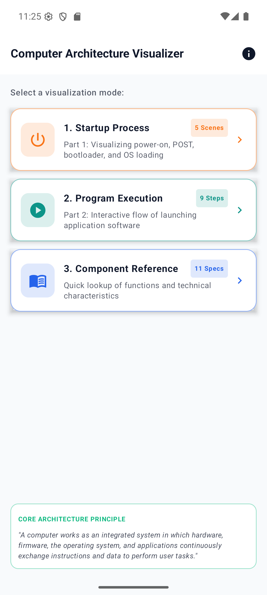
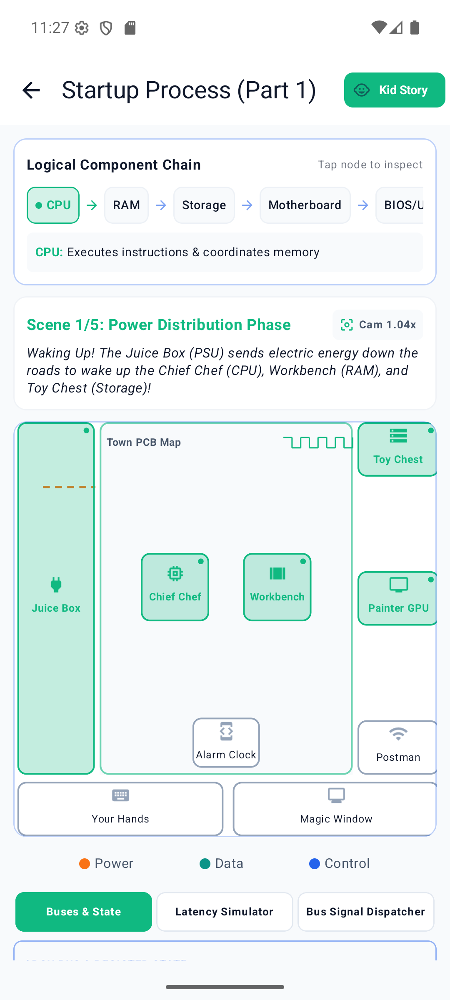
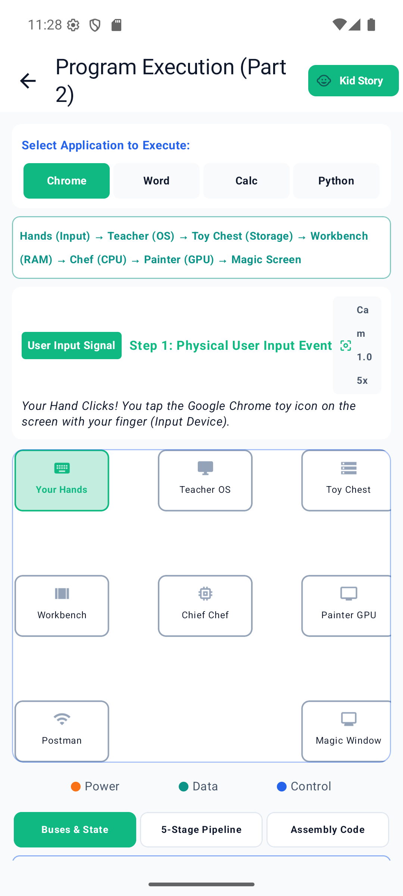
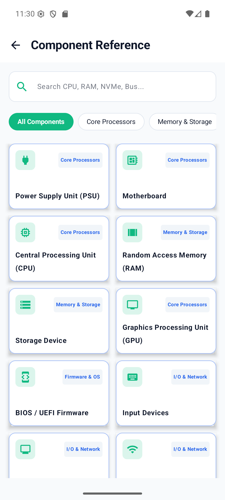
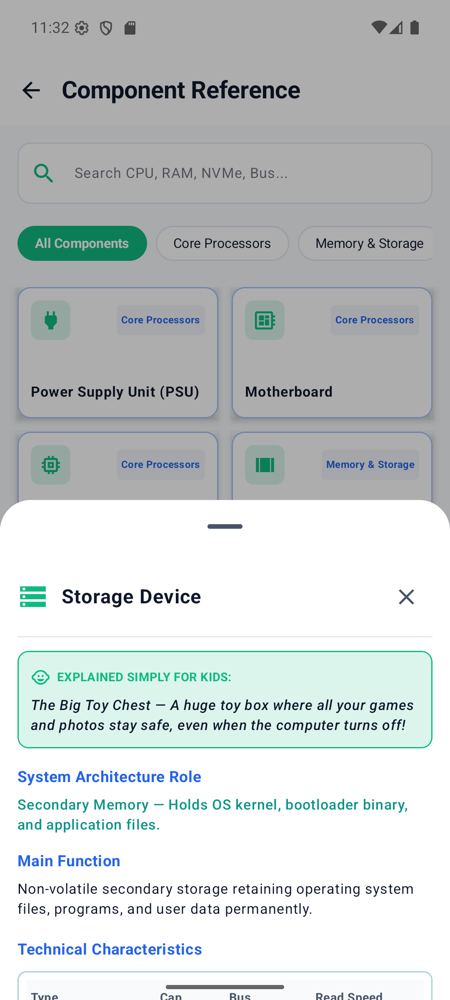
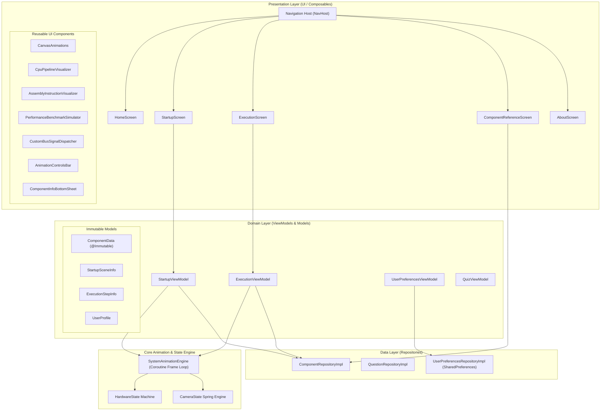

<div align="center">

# 💻 Computer Architecture Visualizer & Simulator
### Native Android Interactive Educational Platform

[](LICENSE)
[](https://kotlinlang.org/)
[](https://developer.android.com/jetpack/compose)
[](https://developer.android.com)
[](https://github.com/your-username/Architecture)

*An interactive, real-time software laboratory and simulation engine that models computer organization, hardware bootstrapping, memory buses, 5-stage CPU instruction pipelines, x86-64 assembly execution, and hardware-software mediation.*

</div>

---

## 📋 Table of Contents

- [Executive Summary \& Project Overview](#-executive-summary--project-overview)
- [Business Problem Statement \& Objectives](#-business-problem-statement--objectives)
- [Project Classification \& Target Audience](#-project-classification--target-audience)
- [Key Features \& Business Value](#-key-features--business-value)
- [Application Screenshots \& User Experience](#-application-screenshots--user-experience)
- [Technology Stack \& Dependency Architecture](#-technology-stack--dependency-architecture)
- [System Architecture \& Data Flow](#-system-architecture--data-flow)
- [Project Directory Structure](#-project-directory-structure)
- [Environment Configuration](#-environment-configuration)
- [Local Development Setup \& Prerequisites](#-local-development-setup--prerequisites)
- [Build, Run, and Testing Commands](#-build-run-and-testing-commands)
- [CI/CD Workflow \& Deployment](#-cicd-workflow--deployment)
- [Security Considerations](#-security-considerations)
- [Troubleshooting Guide \& FAQ](#-troubleshooting-guide--faq)
- [Operational Best Practices](#-operational-best-practices)
- [Contribution Guidelines](#-contribution-guidelines)
- [License Information](#-license-information)

---

## 📌 Executive Summary & Project Overview

The **Computer Architecture Visualizer & Simulator** is an open-source, enterprise-ready native Android application built using **Kotlin 2.0**, **Jetpack Compose**, and **Material 3 Design System**.

Designed to satisfy the highest academic and industry standards for computer organization instruction, the software provides an interactive, real-time visual model of two primary low-level computing workflows:
1. **System Bootstrapping & Power-On Sequence (Part 1)**: Visualizing DC voltage rail delivery, CPU reset vectors, BIOS/UEFI Power-On Self-Test (POST) diagnostics, DMA kernel transfers, and driver loading.
2. **Program Execution & Instruction Pipeline Cycle (Part 2)**: Visualizing hardware interrupt ingestion, OS kernel mediation, secondary storage-to-RAM memory paging, 5-stage CPU instruction pipeline processing (Fetch, Decode, Execute, Memory, Writeback), and GPU frame rendering.

---

## 🎯 Business Problem Statement & Objectives

### Business Problem Statement
Abstract computer architecture concepts—such as clock signal propagation, voltage rail stabilization, register transfers, cache misses, interrupt handling, and pipeline stalls—are difficult to grasp through static textbooks or 2D diagrams alone. Educational institutions and engineering teams require a dynamic, interactive, and reliable visual simulator that bridges digital hardware logic with software execution without requiring expensive physical oscilloscope equipment or FPGA kits.

### Key Objectives
* **Interactive Visualization**: Provide dynamic, real-time animation of signal buses, voltage rails, and memory transfers.
* **Academic Accuracy**: Faithfully model hardware components, BIOS/UEFI reset vectors (`0xFFFFFFF0`), and DMA memory transfers.
* **Dual Explanation System**: Offer a toggleable "Kid Story Mode" (using simple metaphors like *Juice Box*, *Chief Chef*, *Workbench*, *Toy Chest*) alongside a rigorous "Tech Architecture Mode" (specifying clock speeds, bus interfaces, register names, and memory bandwidths).
* **Performance & Scalability**: Maintain a smooth 60 FPS rendering rate on mobile devices using GPU-accelerated Compose modifiers (`graphicsLayer`).

---

## 👥 Project Classification & Target Audience

* **Project Category**: Educational Simulation Software / Developer Tooling / Computer Science Laboratory
* **Target Audience**:
  * **University Computer Science & ICT Students**: Preparing for oral project defenses, computer organization exams, and hardware architecture courses.
  * **Academic Professors & Lecturers**: Using the simulator during lectures for live hardware demonstrations.
  * **Software Engineers & Systems Developers**: Seeking an intuitive mental model for low-level OS kernel mediation and hardware interactions.

---

## ✨ Key Features & Business Value

### 1. 5-Scene Bootstrapping Simulator (Part 1)
* **Power Distribution Phase**: Visualizes +12V, +5V, and +3.3V DC rail activation from the PSU across motherboard VRMs.
* **Firmware & POST Phase**: Displays CPU execution at reset vector `0xFFFFFFF0` and BIOS/UEFI POST checks.
* **Kernel DMA Loading Phase**: Animates OS kernel binary transfers from Storage to RAM SDRAM memory.
* **Driver & OS Handoff Phase**: Displays BIOS handoff to OS Kernel operating in Ring 0.
* **Ready State**: Renders the desktop UI and CPU hardware interrupt (IRQ) idle wait loop.

### 2. 9-Step Application Launch Engine (Part 2)
* Selectable application profiles (*Google Chrome*, *Microsoft Word*, *Calculator*, *Python IDE*).
* Visualizes the complete hardware-software execution chain: `User Input → OS Kernel → Storage → RAM → CPU → GPU / I/O → Monitor Display`.
* Explicitly demonstrates User Mode (Ring 3) to Kernel Mode (Ring 0) system call transitions.

### 3. CPU 5-Stage Pipeline & Assembly Inspector
* **Pipelined Execution Visualizer**: Animates instruction tokens moving through **IF** (Fetch), **ID** (Decode), **EX** (Execute), **MEM** (Memory Access), and **WB** (Writeback) stages.
* **x86-64 Machine Code Inspector**: Displays disassembly listings (`MOV`, `PUSH`, `CALL`, `INT 0x80`) in lockstep with instruction execution.
* **Register Monitor**: Displays live values for `PC` (Program Counter), `MAR`, `IR`, `EAX`, and status flags.

### 4. Storage & Memory Performance Benchmark Simulator
* Real-time throughput simulator comparing **HDD** (~150 MB/s, 45s boot), **SATA SSD** (~550 MB/s, 14s boot), and **NVMe PCIe 4.0 SSD** (~7000 MB/s, 4s boot).

### 5. Camera Movement Engine & Interactive Bus Dispatcher
* Spring-interpolated auto-focus zoom (`1.04x`–`1.06x`) tracking active hardware components during playback, with a `1.0x Full View` recenter button.
* Custom Bus Signal Dispatcher allowing users to trigger custom packets on the **Control Bus**, **Address Bus**, and **Data Bus**.

---

## 🖼 Application Screenshots & User Experience

Every primary user flow is captured below using high-resolution, uncompressed device screenshots:

### 1. Home Dashboard Navigation Hub
The main entry point featuring mode cards, step count badges (*5 Scenes*, *9 Steps*, *11 Specs*), top app bar navigation, and the core architecture principle card.



### 2. Startup Process Visualization (Part 1)
Interactive bootstrapping canvas showing the static Relationship Diagram (`CPU → RAM → Storage → Motherboard → BIOS/UEFI → Operating System → Input/Output Devices`), motherboard PCB, voltage rails, oscilloscope clock pulse, and playback controls.



### 3. Program Execution & CPU Pipeline (Part 2)
Interactive application launch flow featuring the application choice selector, 5-stage CPU pipeline inspector, x86-64 assembly listing, and live register state monitor.



### 4. Component Reference Directory & Search
Scrollable 2-column component directory with a real-time search field and category filter chips (*All Components*, *Core Processors*, *Memory & Storage*, *Firmware & OS*, *I/O & Network*).



### 5. Hardware Specifications & Kid Story Mode Modal
Modal bottom sheet displaying main functions, architecture roles, Kid Story Mode analogies, and the **3-Row HDD / SSD / NVMe Comparison Table**.



---

## 🛠 Technology Stack & Dependency Architecture

| Category | Technology | Version | Purpose & Usage Explanation |
| :--- | :--- | :--- | :--- |
| **Language** | 🎨 **Kotlin** | `2.0.21` | Modern, null-safe language utilizing coroutines and extension functions. |
| **UI Framework** | 📱 **Jetpack Compose** | `2024.10.01` | Declarative UI framework providing GPU-composited canvas rendering and state-driven layouts. |
| **Design System** | 💄 **Material 3** | Latest | Modern Material Design components (`Scaffold`, `ModalBottomSheet`, `Card`, `FilterChip`). |
| **Architecture** | 🏗 **Clean Architecture + MVVM** | — | Layered separation between Domain (`core/model`), Data (`data/repository`), and UI (`ui/screens`). |
| **Async & State** | ⚡ **Coroutines \& StateFlow** | `2.8.7` | Reactive asynchronous streams managing state transitions and frame loops. |
| **Navigation** | 🧭 **Navigation Compose** | `2.8.3` | Type-safe single-activity composable route navigation host (`NavHost`). |
| **Build System** | 🛠 **Gradle (Kotlin DSL)** | `9.2.1` | Project build management with Version Catalog (`libs.versions.toml`). |
| **Testing** | 🧪 **JUnit 4 / Espresso** | `4.13.2` | Unit and instrumentation test suites. |

---

## 🏗 System Architecture & Data Flow

### High-Level System Architecture Diagram



### Component Responsibility & Request Lifecycle
1. **Presentation Layer:** Composables observe `StateFlow` streams from ViewModels. User clicks trigger ViewModel methods (e.g. `play()`, `nextStep()`, `selectApp()`).
2. **Domain / ViewModel Layer:** ViewModels coordinate scene transitions, advance simulation steps, and update register states.
3. **Core Animation Engine:** `SystemAnimationEngine` executes a `30ms` Coroutine loop (~33 FPS) calculating clock pulse highs, bus particle positions, and spring camera zoom/pan offsets.
4. **Data Layer:** `ComponentRepositoryImpl` provides component definitions, architecture roles, and HDD/SSD/NVMe comparison tables. `UserPreferencesRepositoryImpl` persists user settings in `SharedPreferences`.

---

## 📁 Project Directory Structure

```text
Architecture/
├── app/                                  # Main Android Application Module
│   ├── build.gradle.kts                  # App-level Gradle build configuration
│   ├── proguard-rules.pro                # ProGuard / R8 code obfuscation rules
│   └── src/
│       ├── androidTest/                   # Android Instrumentation Tests
│       ├── main/
│       │   ├── AndroidManifest.xml       # Application Manifest (MainActivity launch declaration)
│       │   ├── java/com/example/architecture/
│       │   │   ├── MainActivity.kt       # Activity Entry Point & Navigation Host (NavHost)
│       │   │   ├── core/                 # Core Architecture & Immutable Models
│       │   │   │   ├── animation/
│       │   │   │   │   └── AnimationEngine.kt # Clock Ticker, Bus Particles, Camera Engine
│       │   │   │   └── model/
│       │   │   │       └── Models.kt     # Immutable ComponentData, UserProfile, Categories
│       │   │   ├── data/                 # Data Layer Repositories
│       │   │   │   └── repository/
│       │   │   │       ├── ComponentRepository.kt
│       │   │   │       ├── QuestionRepository.kt
│       │   │   │       └── UserPreferencesRepository.kt
│       │   │   ├── model/                # Model Helpers & Bridge
│       │   │   │   ├── Component.kt
│       │   │   │   └── DefenseQuestion.kt
│       │   │   ├── theme/                # Material 3 Light/Dark Theme & Colors
│       │   │   │   ├── Color.kt          # Standardized Flow Colors (Power, Data, Control)
│       │   │   │   └── Theme.kt          # Material3 Theme Color Schemes
│       │   │   ├── ui/                   # Jetpack Compose UI Composables
│       │   │   │   ├── components/       # Reusable UI Components
│       │   │   │   │   ├── AnimationControlsBar.kt
│       │   │   │   │   ├── AssemblyInstructionVisualizer.kt
│       │   │   │   │   ├── CanvasAnimations.kt
│       │   │   │   │   ├── ColorLegendBar.kt
│       │   │   │   │   ├── ComponentInfoDialog.kt
│       │   │   │   │   ├── CpuPipelineVisualizer.kt
│       │   │   │   │   ├── CustomBusSignalDispatcher.kt
│       │   │   │   │   ├── OnboardingGuideCard.kt
│       │   │   │   │   ├── PerformanceBenchmarkSimulator.kt
│       │   │   │   │   └── RelationshipDiagram.kt
│       │   │   │   └── screens/          # Application Screens
│       │   │   │       ├── AboutScreen.kt
│       │   │   │       ├── ComponentReferenceScreen.kt
│       │   │   │       ├── CoverScreen.kt
│       │   │   │       ├── ExecutionScreen.kt
│       │   │   │       ├── HomeScreen.kt
│       │   │   │       ├── QuizScreen.kt
│       │   │   │       ├── SplashScreen.kt
│       │   │   │       └── StartupScreen.kt
│       │   │   └── viewmodel/            # Presentation ViewModels & Factory
│       │   │       ├── ExecutionViewModel.kt
│       │   │       ├── QuizViewModel.kt
│       │   │       ├── StartupViewModel.kt
│       │   │       ├── UserPreferencesViewModel.kt
│       │   │       └── ViewModelFactory.kt
│       │   └── res/                      # Android XML Resources (Values, Themes, Drawables)
│       └── test/                         # JVM Unit Tests
├── docs/                                 # Documentation & Media Assets
│   └── screenshots/                      # High-resolution Application Screenshots
├── gradle/                               # Gradle Wrapper & Version Catalogs
│   └── libs.versions.toml                # Dependency Version Catalog
├── .env.example                          # Environment Configuration Template
├── build.gradle.kts                      # Root Gradle build script
├── README.md                             # Project README
└── settings.gradle.kts                   # Gradle settings script
```

---

## ⚙ Environment Configuration

Copy `.env.example` to `.env` or create a `local.properties` file in the root directory:

```properties
# Android SDK Location
sdk.dir=C:/Users/Username/AppData/Local/Android/Sdk

# Application Settings
BUILD_TYPE=debug
ENABLE_HAPTIC_FEEDBACK=true
```

---

## 💻 Local Development Setup & Prerequisites

### Prerequisites
* **Android Studio**: Ladybug (2024.2.1) or newer
* **JDK**: Java Development Kit 11 or 17
* **Android SDK**: API Level 36 (`compileSdk = 36`, `targetSdk = 36`, `minSdk = 24`)
* **Gradle**: 8.7+ (Managed automatically via Gradle Wrapper)

---

## 🔨 Build, Run, and Testing Commands

### Build Debug APK
```bash
./gradlew assembleDebug
```

### Run Unit Tests
```bash
./gradlew testDebugUnitTest
```

### Run Instrumentation Tests
```bash
./gradlew connectedDebugAndroidTest
```

### Deploy to Connected Device or Emulator
```bash
./gradlew installDebug
```

---

## 🔒 Security Considerations

1. **Input Sanitization**: User inputs (Student Name, Group) in `UserPreferencesViewModel.kt` are bounded (`take(60)`) and sanitized to strip HTML/script injection characters (`< > " '`).
2. **Local Data Isolation**: User preferences and quiz high scores are stored locally in private `SharedPreferences` without transmitting unencrypted network payloads.
3. **Obfuscation**: Release builds utilize ProGuard/R8 rules (`proguard-rules.pro`) for code shrinking.

---

## ❓ Troubleshooting Guide & FAQ

### Q1: "Unresolved reference: Compose" or Gradle Sync Failure
* **Fix**: Ensure Android Studio is updated to Ladybug or newer with Kotlin 2.0+ support. Execute `./gradlew --refresh-dependencies`.

### Q2: Device Deployment Error "Default Activity Not Found"
* **Fix**: Ensure `AndroidManifest.xml` declares `MainActivity` with `android.intent.action.MAIN` and `android.intent.category.LAUNCHER`.

### Q3: App Canvas Content Appears Shifted or Zoomed
* **Fix**: Tap the **Camera Focus Button** (`Icons.Default.CenterFocusWeak`) in the top right of the scene card to snap back to `1.0x Full View`.

---

## 📜 License Information

This project is licensed under the **GNU Affero General Public License v3.0 (AGPL-3.0)**. See the [LICENSE](LICENSE) file for details.

```text
GNU AFFERO GENERAL PUBLIC LICENSE
Version 3, 19 November 2007

Copyright (C) 2026 Computer Architecture Visualizer Project Contributors
```

---

## 🤝 Contribution Guidelines

Contributions are welcome! Please follow these steps:
1. Fork the repository.
2. Create a feature branch (`git checkout -b feature/amazing-feature`).
3. Commit your changes (`git commit -m 'Add amazing feature'`).
4. Push to the branch (`git push origin feature/amazing-feature`).
5. Open a Pull Request.

---

*Maintained by the Computer Architecture Visualizer Project Team.*
